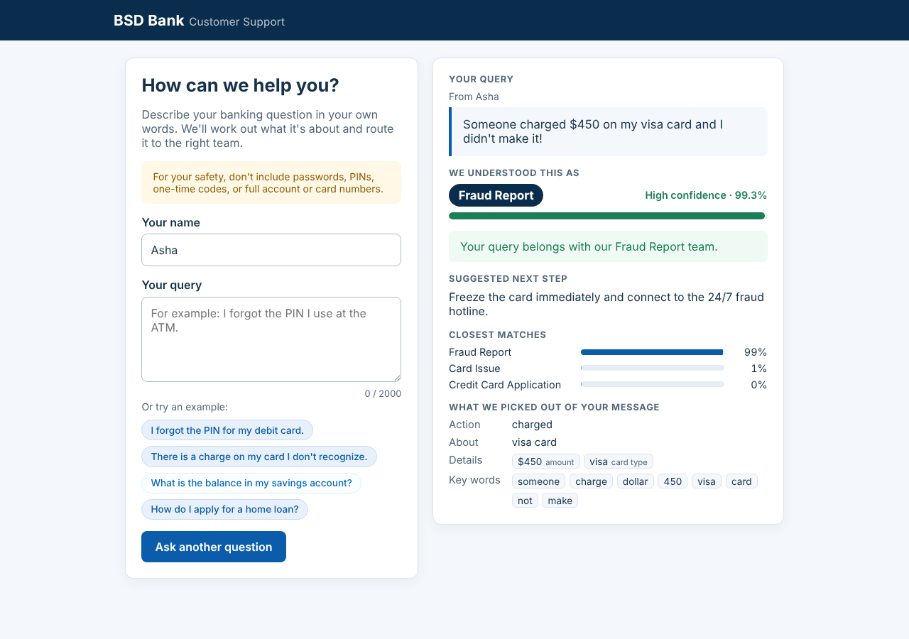
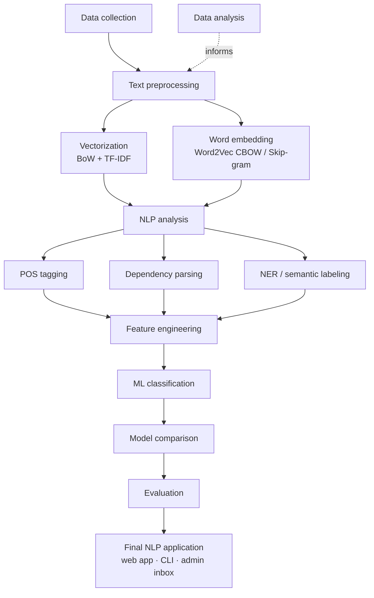

# NLP-Based Banking Customer Query Classification and Intent Analysis

[](.python-version)
[](requirements.txt)
[](app/app.py)
[](#deployment-vercel)
[](tests/)

An end-to-end NLP system that reads a customer's banking query in plain language, works out what the customer wants, and routes it to the right team. It classifies each query into one of **8 banking intents**, reports a calibrated confidence score, flags unfamiliar wording for human review, and explains its decision by extracting the action, topic, and banking entities from the text.

**Held-out test results (818 queries): 97.07% accuracy, 96.42% Macro-F1.**



---

## Contents

- [Features](#features)
- [Supported intents](#supported-intents)
- [Pipeline](#pipeline)
- [Results](#results)
- [Quick start](#quick-start)
- [Usage](#usage)
- [Deployment (Vercel)](#deployment-vercel)
- [Retraining the model](#retraining-the-model)
- [Project structure](#project-structure)
- [Evaluation and robustness](#evaluation-and-robustness)
- [Limitations and roadmap](#limitations-and-roadmap)

---

## Features

- **Intent classification** into 8 banking intents with a calibrated LinearSVC.
- **Confidence and review flagging**: queries with low confidence, or wording far from anything seen in training, are routed to a human instead of being auto-classified.
- **Linguistic analysis**: POS tagging, dependency parsing, named-entity recognition (amounts, card types, masked card numbers, account numbers, dates), and action → target extraction (for example *not working → debit card*).
- **NLP-informed features**: the analysis output feeds the classifier as features, alongside TF-IDF, Word2Vec, and handcrafted linguistic signals.
- **Systematic model comparison**: 5 classifiers × 6 feature sets, selected on validation data only.
- **Customer web app** (Flask): shows the submitted query back with its category, confidence, closest alternatives, suggested next step, and the details extracted from the message.
- **Admin inbox**: a password-protected view of submitted queries and their predictions.
- **Command-line tool** for single-query prediction.
- **Serverless deployment** on Vercel, with PostgreSQL for storage.

## Supported intents

| Intent | Example query |
|---|---|
| Balance Inquiry | "What is the balance in my savings account?" |
| Card Issue | "My debit card is not working at the ATM." |
| Credit Card Application | "How do I apply for a credit card?" |
| Forgot PIN | "I forgot the PIN for my debit card." |
| Fraud Report | "Someone charged $450 on my card and it wasn't me." |
| Loan Inquiry | "What are the interest rates for a personal loan?" |
| Password Reset | "I'm locked out, please reset my online banking password." |
| Transaction Query | "When did my last payment go through?" |

## Pipeline



| Stage | Module | What it does |
|---|---|---|
| 1. Data collection | `src/data_loader.py` | Loads the raw dataset, removes duplicates, fixes a label typo, adds templated examples for two intents missing from the raw data, and makes stratified train/validation/test splits |
| 2. Data analysis | `src/eda.py` | Class balance, query lengths, vocabulary, top n-grams per intent, Word2Vec projection |
| 3. Text preprocessing | `src/preprocessing.py` | Normalization, contraction and shorthand expansion, tokenization, intent-aware stopword removal, POS-aware lemmatization, stemming |
| 4. Vectorization and word embedding | `src/embeddings.py` | Bag-of-Words, TF-IDF, and Word2Vec (CBOW and Skip-gram) trained on the training split only |
| 5. NLP analysis | `src/nlp_analysis.py` | spaCy POS tags, dependency parse, and named entities, plus regex banking entities and action → target extraction; falls back to NLTK when spaCy is unavailable |
| 6. Feature engineering | `src/feature_engineering.py` | Six feature sets: `bow`, `tfidf`, `w2v_cbow`, `w2v_skipgram`, `hybrid` (TF-IDF + IDF-weighted Word2Vec + 11 linguistic features), and `hybrid_nlp` (hybrid + Stage 5 indicators) |
| 7. ML classification | `src/models.py` | Naive Bayes, Logistic Regression, calibrated LinearSVC, Random Forest, Gradient Boosting |
| 8. Model comparison | `src/pipeline.py` | Trains every compatible classifier/feature pair and selects the champion by validation Macro-F1 |
| 9. Evaluation | `src/evaluation.py` | Held-out test metrics, per-class report, confusion matrix, calibration, error analysis |
| 10. Final application | `src/predictor.py`, `app/`, `predict.py` | Inference service, Flask web app, Streamlit demos, CLI |

## Results

### Champion model

Calibrated **LinearSVC** (`C=1.0`, balanced class weights, 5-fold sigmoid calibration) on **`hybrid_nlp`** features. The model is selected on validation data, and the test set is scored once after selection.

| Split | Accuracy | Macro-F1 | Weighted-F1 |
|---|---:|---:|---:|
| Validation (836) | 98.21% | 97.82% | 98.20% |
| Test (818, held out) | 97.07% | 96.42% | 97.05% |

### Model comparison (validation Macro-F1)

| Classifier | BoW | TF-IDF | W2V CBOW | W2V Skip-gram | Hybrid | Hybrid + NLP |
|---|---:|---:|---:|---:|---:|---:|
| Naive Bayes | 94.28 | 94.02 | — | — | — | — |
| Logistic Regression | 95.67 | 96.65 | 93.27 | 93.75 | 95.34 | 96.17 |
| **LinearSVC** | 94.73 | 96.70 | 94.09 | 94.57 | 97.28 | **97.82** |
| Random Forest | 94.96 | 94.12 | 93.60 | 94.89 | 92.91 | 93.49 |
| Gradient Boosting | 94.51 | 92.35 | 92.61 | 92.40 | 92.76 | 92.83 |

Naive Bayes needs non-negative features, so it only runs on BoW and TF-IDF. On its own, the NLP-analysis block reaches 79.27% validation Macro-F1, so it carries real signal that complements the lexical features.

### Per-intent test performance

| Intent | Precision | Recall | F1 | Support |
|---|---:|---:|---:|---:|
| Balance Inquiry | 95.65% | 89.80% | 92.63% | 49 |
| Card Issue | 100.00% | 88.89% | 94.12% | 36 |
| Credit Card Application | 97.73% | 91.49% | 94.51% | 47 |
| Forgot PIN | 100.00% | 100.00% | 100.00% | 36 |
| Fraud Report | 93.30% | 96.28% | 94.76% | 188 |
| Loan Inquiry | 97.95% | 99.58% | 98.76% | 240 |
| Password Reset | 100.00% | 95.56% | 97.73% | 45 |
| Transaction Query | 98.32% | 99.44% | 98.88% | 177 |

Figures are in [`artifacts/figures/`](artifacts/figures/): [confusion matrix](artifacts/figures/confusion_matrix.png), [model comparison](artifacts/figures/model_comparison.png), [confidence calibration](artifacts/figures/confidence_calibration.png), [intent distribution](artifacts/figures/intent_distribution.png), and [Word2Vec projection](artifacts/figures/word2vec_pca.png).

## Quick start

Requires Python 3.13, the version used for development and deployment.

```bash
git clone https://github.com/prudhvikrishn/nlp.git
cd nlp
python -m venv .venv
source .venv/bin/activate              # Windows: .venv\Scripts\activate
pip install -r requirements-project.txt
python -m spacy download en_core_web_sm
python -m unittest discover tests      # 18 tests
```

The trained model ships in `artifacts/models/`, so no training is needed to run the apps. On Windows, `run_demo.bat` does the setup and starts the Streamlit demo in one step.

## Usage

### Command line

```bash
python predict.py "My debit card is not working."
```

```text
Predicted Intent   : Card Issue
Confidence         : 99.7%
Top 3              : card_issue 100%, forgot_pin 0%, password_reset 0%
Action Verb        : not working
Target Entity      : debit card
Entities           : debit card (CARD_TYPE)
Recommended Action : Run card diagnostics (chip/PIN test), then offer instant replacement card.
```

### Web app (Flask)

```bash
python app/app.py
```

Open <http://127.0.0.1:8501>. Submissions are stored in local SQLite (`data/customer_queries.sqlite3`) unless `DATABASE_URL` points to PostgreSQL. To use the admin inbox at `/admin`, set `SECRET_KEY` and `ADMIN_PASSWORD` before starting the app.

### Python

```python
from src.predictor import IntentPredictor

result = IntentPredictor().predict("Someone used my card in another country")
result["intent"], result["confidence"], result["needs_review"]
# ('fraud_report', 0.97..., False)
```

### Streamlit demos

```bash
streamlit run app/customer_streamlit.py --server.port 8501   # customer page
streamlit run app/admin_app.py --server.port 8502            # admin inbox
```

## Deployment (Vercel)

The Flask app in `app/app.py` is a supported Vercel entrypoint, so no build configuration is needed.

1. Import the GitHub repository in Vercel (**Add New → Project**) and keep the defaults. Vercel detects Flask and installs `requirements.txt`.
2. Under **Settings → Environment Variables**, add:

   | Variable | Purpose |
   |---|---|
   | `SECRET_KEY` | Long random string that signs sessions and CSRF tokens |
   | `DATABASE_URL` | PostgreSQL connection string (for example Neon, from Vercel's **Storage** tab). Without it, queries are still classified and shown, but not saved |
   | `ADMIN_PASSWORD` | Password for the `/admin` inbox |

3. Deploy, then check that `/health` returns `{"status": "ok"}`.

> **If Vercel says "Nothing will load at your site's root":** the project was imported as a static site instead of a Flask app. In the project settings, set **Root Directory** to the repository root (leave it empty, not `app`) and **Framework Preset** to **Flask**, then redeploy. `vercel.json` also sets `"framework": "flask"` so the preset can't be guessed wrong.

**How the deployment fits Vercel's constraints:**

- **Bundle size:** `requirements.txt` contains only inference dependencies, about 370 MB installed, which is under Vercel's 500 MB limit for Python functions. spaCy is omitted for that reason, so NLP analysis uses its NLTK fallback in production. Test Macro-F1 with the fallback is 96.20%, against 96.42% with spaCy.
- **NLTK data:** `nltk_data/` bundles the NLTK resources inference needs (WordNet, stopwords, the English POS tagger, and English Punkt). Vercel's file system is read-only, so they cannot be downloaded at runtime.
- **`vercel.json`:** excludes training data, reports, experiments, and figures from the function, and allows 60 seconds for a cold start.

## Retraining the model

```bash
python -c "from src.data_loader import build_datasets; build_datasets()"   # rebuild splits from data/raw/
python -m src.pipeline                                                     # train, compare, evaluate, save
```

The pipeline writes the champion to `artifacts/models/best_model.pkl` and its metrics to `artifacts/models/run_summary.json`, and regenerates every table and figure in `artifacts/figures/`. A full run takes about 4 minutes on a laptop CPU.

**Dataset:** `data/raw/bank_customer_service_intent_classification_dataset.csv` contains 5,000 labelled queries across 6 intents, ranging from formal requests to slang, typos, and angry messages. The loader removes 28 duplicates and adds 539 templated examples (tagged `source=synthetic`) for `card_issue` and `forgot_pin`, which the raw data lacks. Templates are assigned to splits by template family, so no family appears in more than one split. Rebuilding from the raw file reproduces the committed split assignment; the current loader also strips trailing whitespace from 7 queries, which the committed splits keep.

## Project structure

```text
.
├── app/
│   ├── app.py                  # Flask web app (Vercel entrypoint)
│   ├── submissions.py          # PostgreSQL / SQLite storage
│   ├── customer_streamlit.py   # Streamlit customer demo
│   ├── admin_app.py            # Streamlit admin inbox
│   └── templates/              # Customer, admin, and login pages
├── src/
│   ├── data_loader.py          # 1. Data collection and splitting
│   ├── eda.py                  # 2. Data analysis
│   ├── preprocessing.py        # 3. Text preprocessing
│   ├── embeddings.py           # 4. BoW, TF-IDF, Word2Vec
│   ├── nlp_analysis.py         # 5. POS, parsing, NER, action/target
│   ├── feature_engineering.py  # 6. Feature sets
│   ├── models.py               # 7. Classifiers
│   ├── pipeline.py             # 8. Model comparison and training run
│   ├── evaluation.py           # 9. Metrics and figures
│   ├── predictor.py            # 10. Inference service
│   └── utils.py                # Paths, labels, recommended actions
├── data/
│   ├── raw/                    # Original dataset
│   ├── processed/              # Train / validation / test splits
│   └── benchmarks/             # Behavioral test suite
├── artifacts/
│   ├── models/                 # Trained model and run summary
│   └── figures/                # Evaluation tables and charts
├── reports/                    # Leakage and generalization audit
├── experiments/                # Linguistic generalization experiment
├── nltk_data/                  # Bundled NLTK resources for deployment
├── tests/                      # Unit and app tests
├── docs/images/                # README screenshots
├── predict.py                  # Command-line tool
├── requirements.txt            # Inference dependencies (Vercel)
├── requirements-project.txt    # Full development dependencies
└── vercel.json                 # Vercel function configuration
```

## Evaluation and robustness

Beyond the headline test score, the project audits whether that score can be trusted and how far it generalizes.

- **Leakage audit** ([report](reports/leakage_audit_2026-10-02/audit_report.md)): no exact duplicates across splits, and no template family shared between splits. Removing the 18 test queries most similar to training data changes Macro-F1 by only 0.02 points.
- **Calibration:** for the previous baseline model, 10-bin expected calibration error was 2.6 points, so its confidence scores were reasonably reliable in aggregate.
- **Behavioral suite:** 24 of 25 hand-written in-domain queries are classified correctly, and 3 of 4 out-of-scope queries are flagged for review.
- **Unfamiliar wording:** on small hand-written paraphrase and adversarial sets, Macro-F1 falls to 59.9% and 70.3%. An isolated experiment ([report](experiments/linguistic_generalization_2026-10-02/experiment_report.md)) adds 145 varied training examples and raises the paraphrase score to 92.3%. That model has not been promoted, because its evaluation sets were written by the same author as its training additions.

| Evaluation | Previous baseline (`hybrid`) | Current (`hybrid_nlp`) |
|---|---:|---:|
| Test Macro-F1 | 95.75% | 96.42% |
| 5-fold CV Macro-F1 on train | 96.58% ± 0.75 | 96.50% ± 0.51 |
| Paraphrase set Macro-F1 (40 queries) | 53.90% | 59.92% |
| Adversarial set Macro-F1 (40 queries) | 72.71% | 70.33% |

The gain from `hybrid_nlp` is modest: 3 more correct test queries out of 818, and no difference in cross-validation.

## Limitations and roadmap

**Known limitations**

- **Out-of-scope detection is weak.** The current model's review rule flags only 5 of 10 unseen out-of-scope queries. For the previous baseline, the same rule also sent 40 of 80 in-domain queries to review.
- **Paraphrase robustness:** accuracy drops on wording that differs from the training data.
- **Synthetic data:** `card_issue` and `forgot_pin` are trained only on templated examples.
- **Production trade-off:** the Vercel deployment runs without spaCy, at 96.20% instead of 96.42% test Macro-F1.

**Roadmap**

- [ ] Validate on an independent public benchmark by mapping [BANKING77](https://huggingface.co/datasets/PolyAI/banking77) intents to this label set.
- [ ] Add a trained out-of-scope class using [CLINC150](https://github.com/clinc/oos-eval) out-of-scope queries.
- [ ] Replace templated `card_issue` / `forgot_pin` data with real customer queries.
- [ ] Benchmark a sentence-transformer or fine-tuned DistilBERT model against the current champion.
- [ ] Promote the linguistic-generalization model once it passes an independent, blinded evaluation.
